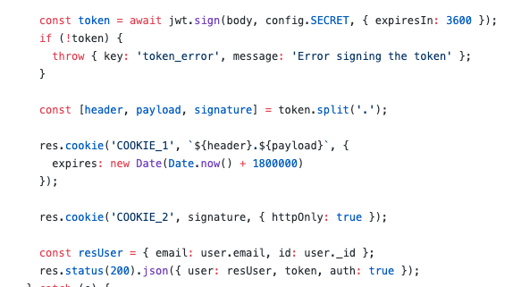

# Portfolio: Auth API

The authentication API for [my portfolio](https://github.com/patchyj/jjwm-portfolio-client), built with Node, Express and Mongo

## Authentication

This API uses a slightly different method of securing on application than most tutorials you see. In this one, when a user logs in after creating an account, a JWT token is generated. Then, innstead of the token being put in the repsonse header, it's then split into two parts (`header.payload` and `signature`) and each is stored in a cookie with different protocols.

On private requests that require verification before returning the data, custom middleware extracts the cookies, reassembles the JWT, verifies its signature with the secret used to create it, and, if successful, moves on to the next block after adding a user object to the response



## Technologies

## How to install

```bash
git clone git@github.com:patchyj/jjwm-portfolio-auth.git

# or download using zip
```

```bash
cd jjwm-portfolio-auth

# if using npm

npm i

# if using yarn

yarn
```

---

## How to run

Once installed, there are two options to run it:

1. `npm start` will start the enire application, including tests and linting everytime the server is restarted

2. `npm run start:dev` will only run the development command, with far reduced noise

---

## Testing

### Unit test: Jest

- `npm run test:watch` to run all tests and watch for changes
- `npm run test:watch <Component>` to run tests for a particular component and watch for changes
- `npm run test:cover` run tests with coverage
- Tests must pass before the build passes

---

## Linting

This app uses Prettier and ESLint for linting and formatting. You can set your own rules in `.eslintrc`. Recommend turning on your editors `format on save`.

- `npm run lint` to run linting for the app
- `npm run lint:fix` to run linting and fix any issues
- Linting must pass before the build passes

---

## Building

### Pipeline: CircleCI

This app uses the free version of [CircleCI](https://circleci.com/) as a pipeline. You'll need to sign up and create an app, and link the app to the Github Repo. The repo settings should be configured to run the pipeline on every push.

In `.circleci/config.yml` replace the following line:

```yml
working_directory: ~/<your-circleci-app>
```

### Pipeline: SonarQube

There's a couple of ways to include the popular SonarQube code quality and vulnerability checks. You can either download it and run it locally using SonarQube's SDK, though using their [official Docker image](https://hub.docker.com/_/sonarqube/) is much easier. You can follow the instructions and choose to include it as a standalone process or include it in a CI/CD pipeline.

However, [SonarCloud](https://sonarcloud.io/) offer an easier alternative: after setting up a new project, you can follow their easy-to-use instructions to include a SonarQube step in CircleCI connected directly to the Github Repo and the CircleCI cloud app. You just need to include the step in `.circleci/config.yml` and include a `sonar-project.properties` file in the root

```yml
# .circleci/config.yml

version: 2.1
orbs:
  sonarcloud: sonarsource/sonarcloud@1.0.1
      # previous steps...
      - sonarcloud/scan

workflows:
  main:
    jobs:
      - build:
          context: SonarCloud
```

```yml
# .circleci/config.yml

sonar.projectKey=<your-project-key>
sonar.organization=<your-project-organisation>
# This is the name and version displayed in the SonarCloud UI.
#sonar.projectName=<your-project-name>
#sonar.projectVersion=1.0

# Path is relative to the sonar-project.properties file. Replace "\" by "/" on Windows.
#sonar.sources=.

# Encoding of the source code. Default is default system encoding
#sonar.sourceEncoding=UTF-8
```

### Docker

This project includes a `Dockerfile`, `docker-compose.yml` and `.dockerignore` to generate a production build

To build the image:

```bash
docker build . -t auth-api
```

To run the image:

```bash
docker run -p 8000:80 auth-api
```

Then go to `http://localhost:8000` to see the project

## Deployment

For ease of use, this project uses Heroku for deployment, and is configured to run on a Docker instance that's built on every new push / merge to master
